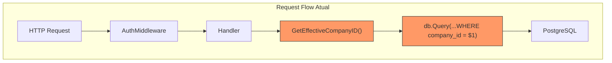
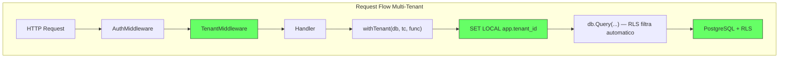
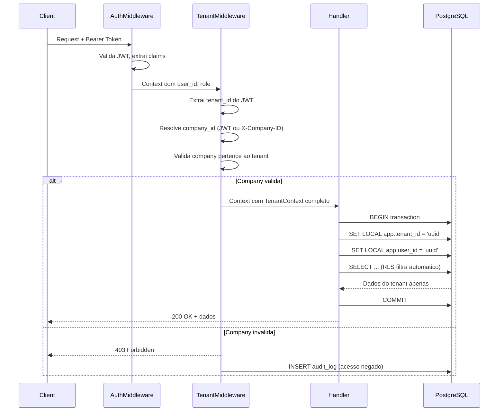
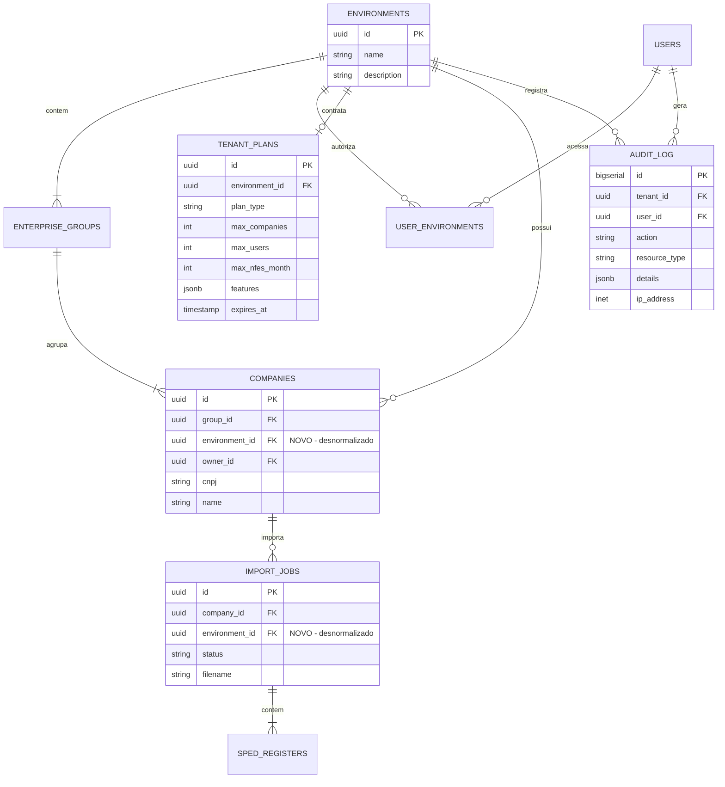
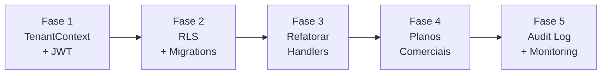

# Architecture Decision Record - Multi-Tenancy Nativo

**Author:** Claudio Bezerra
**Date:** 2026-02-12
**Status:** Proposed
**Phase:** FASE 2 - Fundacao Multi-Tenant

---

## 1. Contexto Arquitetural

### 1.1 Estado Atual (v5.1.0)



**Problemas identificados:**

- Cada handler implementa isolamento manualmente (D e E em vermelho)
- `GetEffectiveCompanyID()` resolve empresa mas nao valida tenant
- Header `X-Company-ID` nao verifica se empresa pertence ao tenant do usuario
- Nenhum RLS no banco — isolamento depende 100% do codigo Go
- Materialized Views (`mv_mercadorias_agregada`, `mv_operacoes_simples`) nao tem filtro de tenant

### 1.2 Estado Alvo (Fase 2)



**Melhorias:**

- TenantMiddleware resolve contexto automaticamente (C em verde)
- `withTenant()` configura sessao PostgreSQL para RLS (F em verde)
- RLS filtra dados automaticamente no banco (H em verde)
- Handlers nao precisam de WHERE manual para isolamento de tenant

---

## 2. Decisoes Arquiteturais

### ADR-001: Estrategia de Multi-Tenancy

**Decisao:** Shared Database + Shared Schema + RLS (Row-Level Security)

**Alternativas consideradas:**

| Estrategia | Isolamento | Custo | Complexidade | Escala |
|-----------|-----------|-------|-------------|--------|
| Database per tenant | Maximo | Alto | Alta (conexoes) | Dificil > 100 tenants |
| Schema per tenant | Alto | Medio | Media (migrations) | Dificil > 50 tenants |
| **Shared + RLS** | Bom | Baixo | **Baixa** | **Facil > 1000 tenants** |
| Shared + WHERE only | Fragil | Baixo | Baixa | Facil |

**Justificativa:**

- FBTax Cloud atende centenas de escritorios/empresas (shared e mais eficiente)
- PostgreSQL RLS e maduro e performatico com indices adequados
- Complexidade operacional minima (uma migration, um schema)
- Pode evoluir para schema-per-tenant para clientes enterprise no futuro
- Custo de infraestrutura minimo (um banco de dados)

---

### ADR-002: Tenant Identity

**Decisao:** `environment_id` (UUID) como `tenant_id` canonico

**Justificativa:**

- `environments` ja existe como conceito de isolamento
- Cada usuario ja e vinculado a um environment via `user_environments`
- Auto-provisioning no registro ja cria environment isolado
- Renomear conceitualmente: `environment` = `tenant`

**Impacto:**

- Nao renomear tabela/coluna (evitar breaking change)
- Adicionar alias constante no codigo: `const TenantIDColumn = "environment_id"`
- Documentar que `environment_id` = `tenant_id` em todo o codigo novo

---

### ADR-003: Propagacao do Tenant Context

**Decisao:** JWT expandido + Middleware + Session Variables PostgreSQL

**Fluxo detalhado:**



---

### ADR-004: Estrutura do TenantContext

**Decisao:** Struct Go propagado via `context.Context`

```go
// backend/middleware/tenant.go

type TenantContext struct {
    UserID     string // UUID do usuario autenticado
    TenantID   string // UUID do environment (tenant)
    CompanyID  string // UUID da empresa ativa
    Role       string // Role global: "admin" | "user"
    TenantRole string // Role no tenant: "admin" | "editor" | "viewer"
}

// Chave de contexto
type tenantContextKey struct{}
var TenantKey = tenantContextKey{}

// Helper para handlers
func GetTenantContext(ctx context.Context) TenantContext {
    tc, _ := ctx.Value(TenantKey).(TenantContext)
    return tc
}
```

---

### ADR-005: Wrapper de Transacao com Tenant

**Decisao:** Funcao `withTenant()` encapsula SET LOCAL + transacao

```go
// backend/middleware/tenant.go

func WithTenant(db *sql.DB, ctx context.Context, fn func(tx *sql.Tx) error) error {
    tc := GetTenantContext(ctx)

    tx, err := db.BeginTx(ctx, nil)
    if err != nil {
        return fmt.Errorf("begin tx: %w", err)
    }
    defer tx.Rollback()

    // Configura sessao PostgreSQL para RLS
    if _, err := tx.ExecContext(ctx,
        "SELECT set_config('app.tenant_id', $1, true), set_config('app.user_id', $2, true)",
        tc.TenantID, tc.UserID,
    ); err != nil {
        return fmt.Errorf("set tenant session: %w", err)
    }

    if err := fn(tx); err != nil {
        return err
    }

    return tx.Commit()
}
```

**Nota:** Usa `set_config(..., true)` que e equivalente a `SET LOCAL` mas funciona via query parametrizada (evita SQL injection).

---

### ADR-006: RLS Policies

**Decisao:** Policies simples baseadas em `environment_id` direto na tabela

**Pre-requisito:** Desnormalizacao (ADR-007) deve ser aplicada antes.

```sql
-- Tabelas com RLS (todas que contem dados de tenant)

-- 1. Enterprise Groups
ALTER TABLE enterprise_groups ENABLE ROW LEVEL SECURITY;
ALTER TABLE enterprise_groups FORCE ROW LEVEL SECURITY;
CREATE POLICY tenant_policy ON enterprise_groups
    USING (environment_id = current_setting('app.tenant_id', true)::uuid);

-- 2. Companies
ALTER TABLE companies ENABLE ROW LEVEL SECURITY;
ALTER TABLE companies FORCE ROW LEVEL SECURITY;
CREATE POLICY tenant_policy ON companies
    USING (environment_id = current_setting('app.tenant_id', true)::uuid);

-- 3. Import Jobs
ALTER TABLE import_jobs ENABLE ROW LEVEL SECURITY;
ALTER TABLE import_jobs FORCE ROW LEVEL SECURITY;
CREATE POLICY tenant_policy ON import_jobs
    USING (environment_id = current_setting('app.tenant_id', true)::uuid);

-- 4. Dados fiscais (nfe_data, reg_c100, etc.)
-- Mesma policy para cada tabela de dados
```

**Notas criticas:**

- `FORCE ROW LEVEL SECURITY` garante que RLS se aplica ate para o owner da tabela
- `current_setting('app.tenant_id', true)` — o `true` retorna NULL se nao setado (em vez de erro), o que faz a policy negar acesso por padrao
- O usuario de aplicacao PostgreSQL NAO deve ser superuser

---

### ADR-007: Desnormalizacao do Tenant ID

**Decisao:** Adicionar `environment_id` como coluna direta em todas as tabelas de dados

**Antes (JOIN necessario):**

```
import_jobs.company_id -> companies.group_id -> enterprise_groups.environment_id
```

**Depois (acesso direto):**

```
import_jobs.environment_id  (coluna propria)
companies.environment_id    (coluna propria)
```

**Migration de dados:**

```sql
-- companies: derivar de enterprise_groups
ALTER TABLE companies ADD COLUMN IF NOT EXISTS environment_id UUID;
UPDATE companies c SET environment_id = eg.environment_id
FROM enterprise_groups eg WHERE c.group_id = eg.id;
ALTER TABLE companies ALTER COLUMN environment_id SET NOT NULL;
ALTER TABLE companies ADD CONSTRAINT fk_companies_tenant
    FOREIGN KEY (environment_id) REFERENCES environments(id);

-- import_jobs: derivar de companies
ALTER TABLE import_jobs ADD COLUMN IF NOT EXISTS environment_id UUID;
UPDATE import_jobs ij SET environment_id = c.environment_id
FROM companies c WHERE ij.company_id = c.id;

-- Indices para RLS performance
CREATE INDEX CONCURRENTLY idx_companies_env ON companies(environment_id);
CREATE INDEX CONCURRENTLY idx_import_jobs_env ON import_jobs(environment_id);
```

**Trigger para manter consistencia:**

```sql
-- Trigger: auto-preenche environment_id em companies novos
CREATE OR REPLACE FUNCTION set_company_environment_id()
RETURNS TRIGGER AS $$
BEGIN
    IF NEW.environment_id IS NULL THEN
        SELECT environment_id INTO NEW.environment_id
        FROM enterprise_groups WHERE id = NEW.group_id;
    END IF;
    RETURN NEW;
END;
$$ LANGUAGE plpgsql;

CREATE TRIGGER trg_set_company_env
    BEFORE INSERT ON companies
    FOR EACH ROW EXECUTE FUNCTION set_company_environment_id();
```

---

### ADR-008: Materialized Views e RLS

**Problema:** RLS nao se aplica a Materialized Views automaticamente.

**Decisao:** Adicionar `environment_id` e `company_id` nas MVs e filtrar explicitamente.

```sql
-- Recriar MV com environment_id
CREATE MATERIALIZED VIEW mv_mercadorias_agregada AS
SELECT
    r.company_id,
    c.environment_id,  -- NOVO
    -- ... demais colunas agregadas
FROM reg_c170 r
JOIN companies c ON r.company_id = c.id
-- ... demais JOINs
GROUP BY 1, 2, ...;

-- Indice na MV para filtro rapido
CREATE INDEX idx_mv_merc_tenant ON mv_mercadorias_agregada(environment_id, company_id);
```

**Nos handlers:** Queries em MVs continuam usando WHERE explicito (MVs nao suportam RLS), mas o TenantContext garante que o `environment_id` correto e passado.

---

### ADR-009: JWT Token Expandido

**Decisao:** Adicionar `tenant_id` e `company_id` ao JWT

**Estrutura do token:**

```json
{
  "user_id": "uuid-user",
  "role": "user",
  "tenant_id": "uuid-environment",
  "company_id": "uuid-company-default",
  "tenant_role": "admin",
  "exp": 1739400000,
  "iat": 1739313600
}
```

**Retrocompatibilidade:**

- Se JWT nao contem `tenant_id` (token antigo), middleware resolve via DB (fallback)
- Apos 30 dias, fallback e removido e JWT sem tenant_id e rejeitado
- Frontend deve re-autenticar para obter novo token com tenant_id

---

### ADR-010: Planos Comerciais

**Decisao:** Tabela `tenant_plans` com limites e features por plano

```sql
CREATE TABLE tenant_plans (
    id UUID PRIMARY KEY DEFAULT gen_random_uuid(),
    environment_id UUID NOT NULL REFERENCES environments(id) ON DELETE CASCADE,
    plan_type VARCHAR(50) NOT NULL DEFAULT 'trial',
    max_companies INT DEFAULT 1,
    max_users INT DEFAULT 1,
    max_nfes_month INT DEFAULT 100,
    features JSONB DEFAULT '["apuracao_icms"]',
    starts_at TIMESTAMP WITH TIME ZONE DEFAULT CURRENT_TIMESTAMP,
    expires_at TIMESTAMP WITH TIME ZONE,
    created_at TIMESTAMP WITH TIME ZONE DEFAULT CURRENT_TIMESTAMP,
    updated_at TIMESTAMP WITH TIME ZONE DEFAULT CURRENT_TIMESTAMP,
    UNIQUE(environment_id)
);
```

**Planos iniciais:**

| Plano | max_companies | max_users | max_nfes_month | Features |
|-------|--------------|-----------|----------------|----------|
| trial | 1 | 1 | 100 | apuracao_icms |
| starter | 3 | 3 | 1.000 | apuracao_icms, pis_cofins |
| professional | 10 | 10 | 10.000 | apuracao_icms, pis_cofins, icms_st, relatorios |
| enterprise | ilimitado | ilimitado | ilimitado | todos |

---

### ADR-011: Audit Log

**Decisao:** Tabela de auditoria com trigger PostgreSQL

```sql
CREATE TABLE audit_log (
    id BIGSERIAL PRIMARY KEY,
    tenant_id UUID,
    user_id UUID,
    action VARCHAR(50) NOT NULL,
    resource_type VARCHAR(100),
    resource_id UUID,
    details JSONB,
    ip_address INET,
    user_agent TEXT,
    created_at TIMESTAMP WITH TIME ZONE DEFAULT CURRENT_TIMESTAMP
);

-- Particionar por mes para performance
CREATE INDEX idx_audit_tenant_date ON audit_log(tenant_id, created_at);
CREATE INDEX idx_audit_user_date ON audit_log(user_id, created_at);

-- NAO aplicar RLS na audit_log (admin precisa ver tudo)
```

---

## 3. Diagrama ERD Atualizado



---

## 4. Impacto em Arquivos Existentes

| Arquivo | Impacto | Descricao |
|---------|---------|-----------|
| `backend/handlers/auth.go` | **Alto** | Expandir JWT com tenant_id, refatorar GenerateToken e LoginHandler |
| `backend/main.go` | **Alto** | Adicionar TenantMiddleware na cadeia, refatorar wrappers |
| `backend/handlers/report.go` | **Medio** | Migrar para WithTenant(), remover GetEffectiveCompanyID manual |
| `backend/handlers/upload.go` | **Medio** | Migrar para WithTenant() |
| `backend/handlers/job.go` | **Medio** | Migrar para WithTenant() |
| `backend/handlers/environment.go` | **Medio** | Adaptar queries para TenantContext |
| `backend/handlers/admin.go` | **Baixo** | Admin bypassa RLS (superuser ou policy especifica) |
| `backend/migrations/` | **Alto** | 3-4 novas migrations (RLS, desnormalizacao, planos, audit) |
| `frontend/src/contexts/AuthContext.tsx` | **Baixo** | Armazenar tenant_id do novo JWT |

---

## 5. Estrategia de Migracao

### Principio: Zero Downtime

Cada fase e retrocompativel. O sistema funciona durante toda a migracao.



### Rollback

- Cada migration tem script de rollback (DOWN)
- RLS pode ser desabilitado com `ALTER TABLE ... DISABLE ROW LEVEL SECURITY`
- JWT antigo continua funcionando durante periodo de transicao
- Feature flags controlam ativacao gradual
