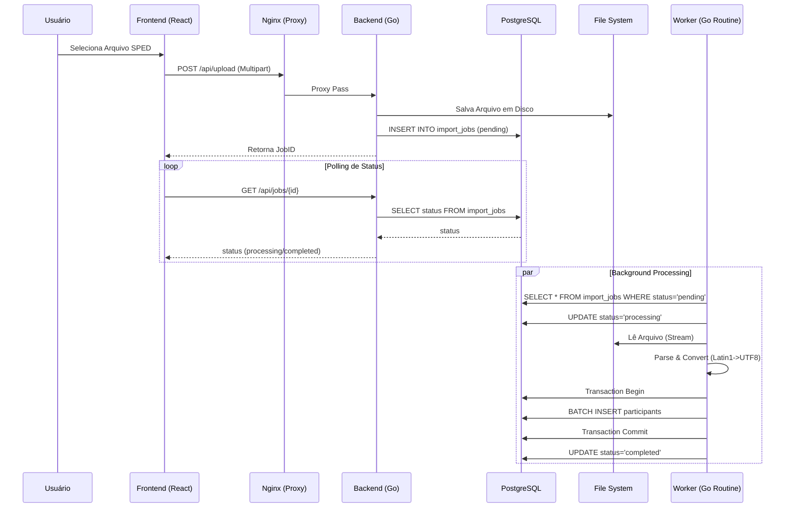
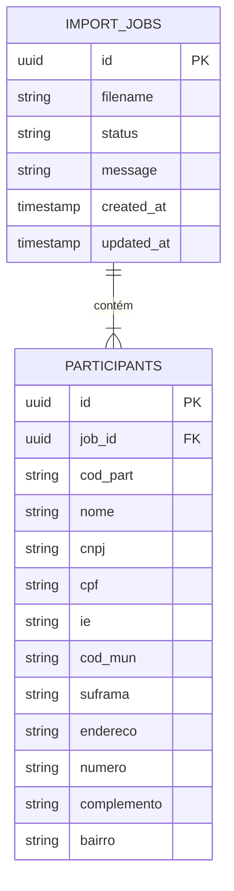

# Arquitetura do Sistema - FB_APU01

## Diagrama de Fluxo de Dados (Data Flow)

## Estrutura de Banco de Dados (ERD Simplificado)

## Componentes Principais

### 1. API Gateway / Reverse Proxy (Nginx)
Atua como ponto de entrada único, servindo o frontend estático e encaminhando requisições `/api` para o backend. Configurado para aceitar grandes payloads (necessário para arquivos SPED de 100MB+).

### 2. Fiscal Engine (Go)
O coração do sistema. Diferente de soluções em Node.js ou Python, o motor em Go utiliza tipagem estática e compilação nativa para processar gigabytes de texto em segundos.
- **Worker Pool**: Gerencia a carga de processamento sem bloquear a API principal.
- **Streaming Decoder**: Processa arquivos maiores que a memória RAM disponível.

### 3. Camada de Persistência (PostgreSQL)
Banco de dados relacional robusto. Utiliza chaves estrangeiras (`ON DELETE CASCADE`) para garantir integridade referencial (se um Job é deletado, seus dados importados também são).