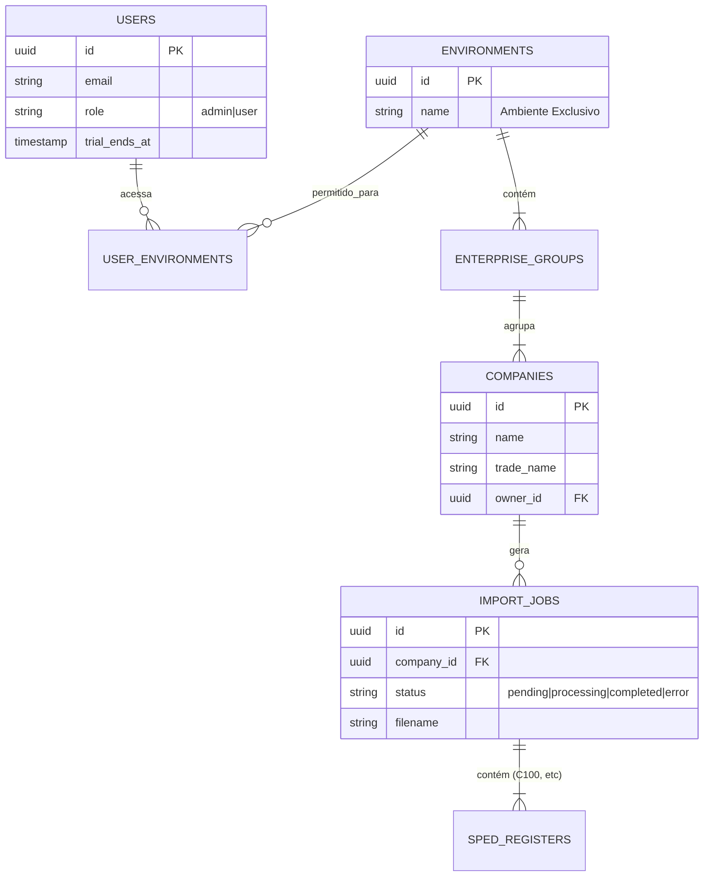
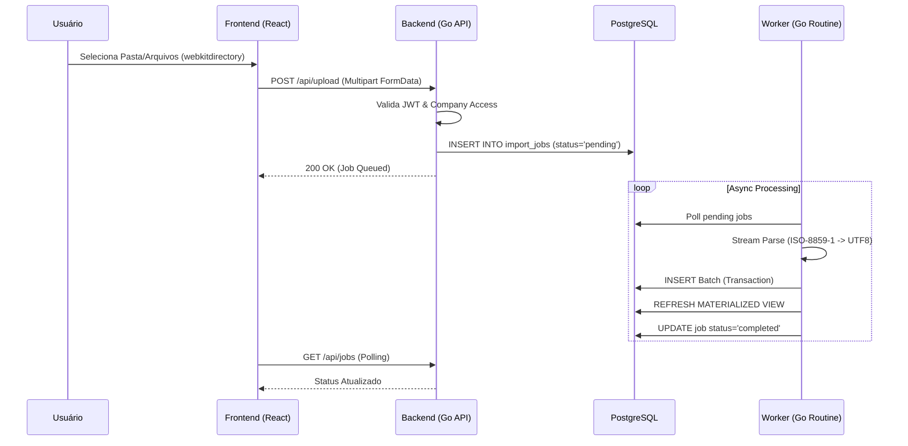

# Arquitetura do Sistema - FB_APU01

## 1. Diagrama de Entidade-Relacionamento (ERD) - Lógico

A estrutura de dados suporta multi-tenancy hierárquico e processamento assíncrono.

## 2. Fluxo de Dados (Data Flow)

### 2.1 Fluxo de Upload e Processamento (Bulk)

## 3. Componentes de Software

### 3.1 Backend (Go)
- **Camada de Handlers**: Responsável pela validação de entrada, autenticação (Middleware) e roteamento.
- **Camada de Serviço (Worker)**: Desacoplada da API HTTP. Processa arquivos pesados sem bloquear a interface.
- **Camada de Dados**: Acesso direto via `database/sql` para performance máxima. Uso extensivo de SQL nativo para agregações complexas.

### 3.2 Frontend (React)
- **Context API**: `AuthContext` gerencia sessão e renovação de tokens.
- **Hooks Personalizados**: `useUpload` para gerenciar fila de envio de arquivos.
- **Componentes Visuais**: Shadcn/UI para consistência visual.

### 3.3 Banco de Dados (PostgreSQL)
- **Tabelas Raw**: Armazenam dados brutos do SPED (ex: `reg_c100`, `reg_0150`).
- **Materialized Views**: Pré-calculam totais por período/CFOP/Alíquota para performance de leitura em dashboards.
- **Schema Migrations**: Controle de versão do esquema de banco de dados.

## 4. Estratégia de Deploy
- **Ambiente**: Linux VPS (Hostinger).
- **Containerização**: Docker Compose gerenciando serviços (App, DB, Nginx).
- **CI/CD**: Git-based deployment (Push to Main -> Pull & Restart on Server).
